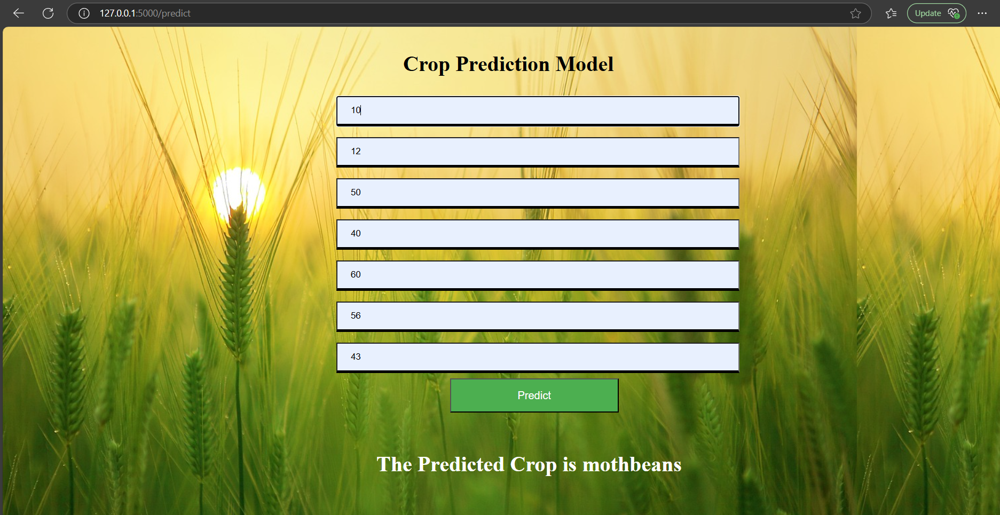

#  Crop Prediction Model

This is a simple machine learning Flask web app that predicts the most suitable crop based on soil and weather parameters.

##  Features
- Input soil nutrients: N, P, K
- Input weather data: temperature, humidity, pH, rainfall
- Predicts the crop using a trained ML model
- Simple and clean UI with background

##  Project Structure
app.py # Flask application
model.pkl # Trained ML model
index.html # Frontend HTML
style.css # Custom CSS
background.jpg # Background image
requirements.txt # Python dependencies

##  How to Run

1. Clone the repository  
2. Install dependencies  
pip install -r requirements.txt
3. Run the app  
python app.py
4. Visit `http://127.0.0.1:5000` in your browser.

##  Screenshots

##  Author

Sarandeep Singh Sohil  
